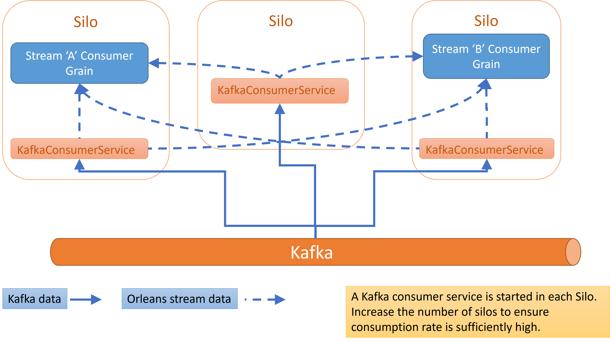

# Orleans Stream Processing with Kafka
This starter sample demonstrates how Orleans streaming may be used with Kafka to enable scenarios such as online model scoring (with ML.Net, TorchSharp.Net or ONNX). Several key aspects are noted below:

- **Scalability**: Kafka clusters can handle millions of messages / second. The system can be scaled to the desired consumption rate by adding the required number of silo instances in the Orleans cluster.

- **Efficieny**: Efficent Kafka consumption is enabled via the Confluent librdkafka 'C' library that underpins the Net Kafka package. In addition, the code allows for early filtering and aggregation of Kafka data - before it is injected to an Orleans stream.

- **Asynchronous Streaming Pipelines**: Demonstrates the use of the F# AsynSeq pacakge to easily express (stateless or stateful) streaming logic via asyncronhous computations.

## Architecture

### See also: [Write up](https://www.linkedin.com/pulse/applying-some-unconventional-wisdom-improve-model-wrt-waris-phd/?trackingId=p%2F4zlZpMK7sGmLN80Nly%2FA%3D%3D)

## Solution project descriptions:

- FsOrleansKafka: Isolates the common Kafka and streams processing. It may be turned into a nuget package later

- OKCodeGen: A C# project that is needed by Orleans to generate the required serialization code. Orleans currently generates only C# code.

- OKGrains: The Kafka configuration and stream consumers grains

- OKSilo: The silo project that will host the grain and service instances.